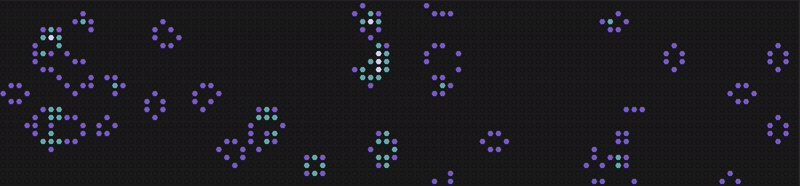

## Game of tiny Life

Had a little fun with   [Conway's Game of Life](https://en.wikipedia.org/wiki/Conway%27s_Game_of_Life)

General idea :
- the universe of the game id infinite, two-dimensional grid of square cells
- a cell is in two possible states : live or dead
- a cell is born if it has 3 living neighbors, it stays alive if it has 2 or 3 living neighbors. Otherwise, a cell dies from loneliness or overpopulation.
- life continues as long as at least one cell is alive AND the previous configuration doesn't match the current one.


## How to run
```
bash start.sh
```
